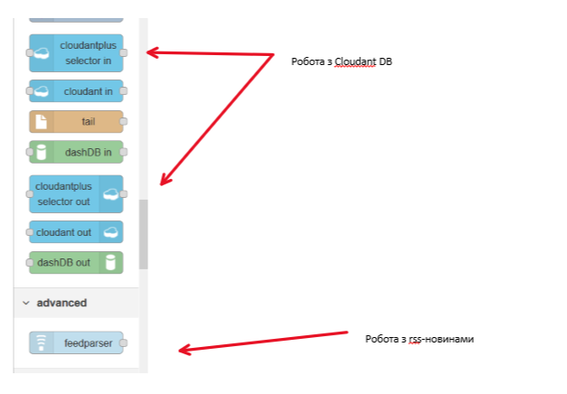
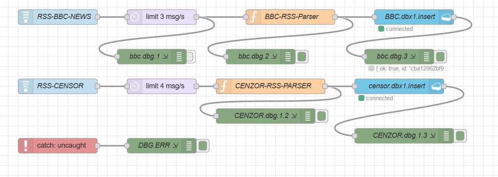
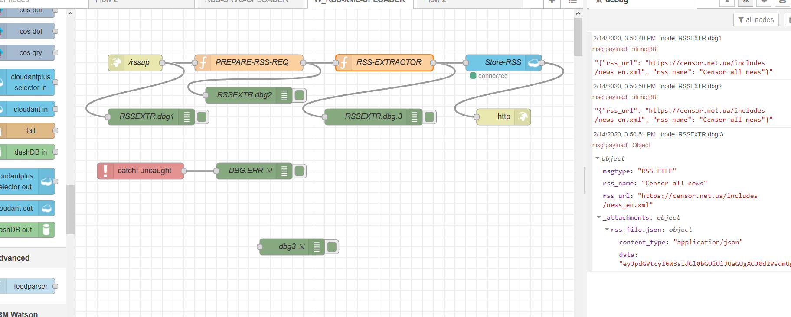

# Програмні складові Node-RED. Приклад роботи з NoSql  базою даних IBM Cloudant (Apache Couch-DB)

## Приклад сервісу, що забезпечує аналіз rss-стрічки новин, та хапис новин в БД для подальшого аналізу.

### Бібліотеки, що потрібні для роботи

"node-red-contrib-cloudantplus-selector": "^0.1.4",
"rss-to-json": "^1.0.5",
"uuid": "^3.4.0"
"node-red-node-feedparser": "^0.1.15",

Ці бібліотеки потрібно додати в package.json руками, та запустити toolchain на deployment. В результаті в cloud  побачимо додаткові вузли.

<kbd></kbd>

Бібліотеки:
"rss-to-json": "^1.0.5",
"uuid": "^3.4.0"

використовуються в функціях і їх потрібно добабти в **bluemix-settings.js** в структуру  **functionGlobalContext:**

```js
    functionGlobalContext: { 
        uuidv4: require('uuid/v4'),
        rsstojson: require('rss-to-json')

    },
```

Потік, що читає та розбирає потік новин на окремі items показаний на малюнку:
 <kbd></kbd>

Кожна новина записується окремо в БД  Cloudant: Заголовок новини і вкладення. Документ БД  виглядає таким чином:

<kbd></kbd>

## Загрузка XML rss  в БД CLoudant

Це потік дозволяє прочитати задану користувачем rss-стрічку, та записати її як attachment у вигляді великого json файлу.
<kbd></kbd>

Пртік приймає на вхід URL  та найменування RSS-  стрічки, та повертає реквізити документу, створеного в БД Cloudant.


- Запит
method: http-post

url=https://nod-red-wshp.eu-gb.mybluemix.net/rssup

Request:
```json
{ 
    "rss_url": "https://censor.net.ua/includes/news_en.xml",
    "rss_name": "Censor all news"

}
```


Response:
Реквізити створеного в БД документу

```json
{
  "ok": true,
  "id": "4ca31f32b13a48b31e58bcf2288ca697",
  "rev": "1-9819141a3a07c1ea1805112b26532cdf"
}

```

Найбільшу цікавість являє собою возол оброки запиту **RSS-EXTRACTOR**

```js
// Додаємо  сецифічні пакети
//var uuidv4 = global.get('uuidv4');

var xrss = global.get('rsstojson');

//Читаю URL стрічки  новин
let l_rss_url=flow.get('i-rss-url');
let l_rss_name=flow.get('i-rss-name');

//Викликаю загрузку rss-стрічку
// асинхронний виклик
xrss.load(l_rss_url, function(err, rss){
    
    //@link=https://developer.ibm.com/recipes/tutorials/nodered-exception-handling-framework/
    if ( err) {
        // якщо помилка
        node.error( err );
        console.log(err);
        console.log(msg.payload);
    } else {
       //success    
        var rsp = {};
    
        /** Готую вкладення*/
        // 1. перевожу вкладення в string
        var rss_str = JSON.stringify(rss);
        //2. Кодую вкладення в BASE64
        var rss_buf = new Buffer( rss_str );
        var rss_buf64 = rss_buf.toString('base64');
       
        //Формую структуру json файла для переді в БД
        //з attachment у вигляді файлу: rss_file.json 
        rsp = { msgtype: 'RSS-FILE', 
                rss_name: l_rss_name, 
                rss_url: l_rss_url,
                "_attachments": {
                                    "rss_file.json": {
                                        "content_type": "application/json",
                                        "data": rss_buf64
                                    }
                }
        } ;
    
        // формую асинхронну відповідь
        msg.payload = rsp ;
        node.send(msg); 
        node.done();
    }  // if(err)
    
});

// без msg,  тому асинхронна відповідь
return ;

```

