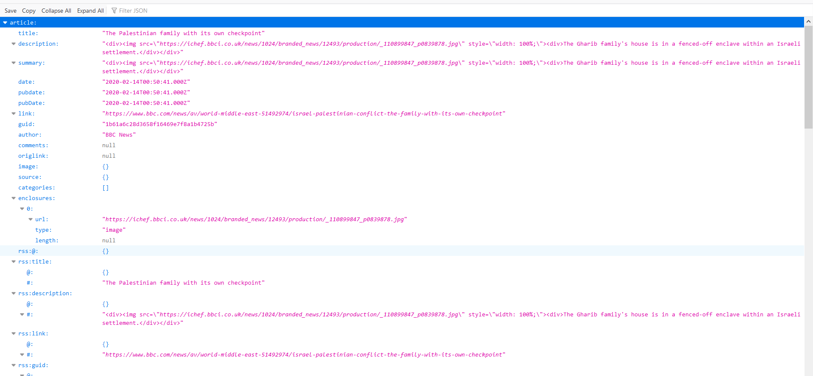

# Програмні складові Node-RED. Приклад роботи з NoSql  базою даних IBM Cloudant (Apache Couch-DB)

## Приклад сервісу, що забезпечує аналіз rss-стрічки новин, та хапис новин в БД для подальшого аналізу.

### Бібліотеки, що потрібні для роботи

"node-red-contrib-cloudantplus-selector": "^0.1.4",
"rss-to-json": "^1.0.5",
"uuid": "^3.4.0"
"node-red-node-feedparser": "^0.1.15",

Ці бібліотеки потрібно додати в package.json руками, та запустити toolchain на deployment. В результаті в cloud  побачимо додаткові вузли.

<kbd></kbd>

Бібліотеки:
"rss-to-json": "^1.0.5",
"uuid": "^3.4.0"

використовуються в функціях і їх потрібно добабти в **bluemix-settings.js** в структуру  **functionGlobalContext:**

```js
    functionGlobalContext: { 
        uuidv4: require('uuid/v4'),
        rsstojson: require('rss-to-json')

    },
```

Потік, що читає та розбирає потік новин на окремі items показаний на малюнку:
 <kbd></kbd>

Кожна новина записується окремо в БД  Cloudant: Заголовок новини і вкладення. Документ БД  виглядає таким чином:

<kbd></kbd>
