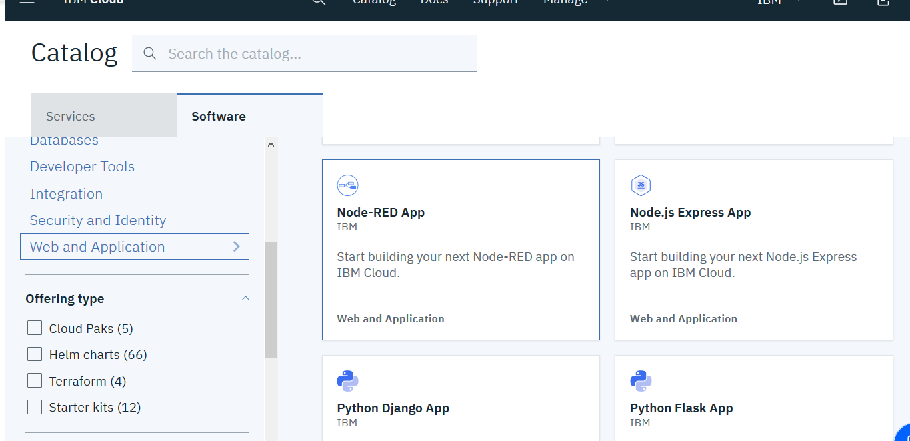
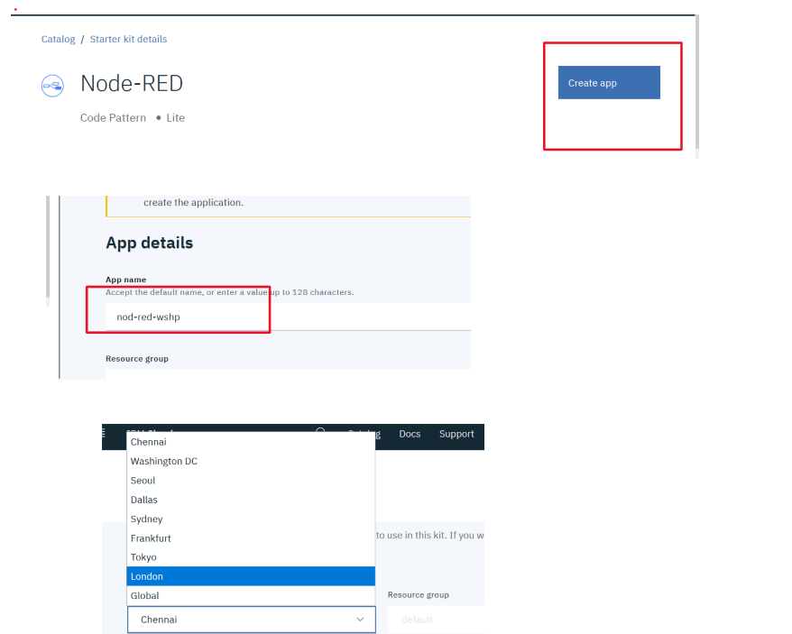
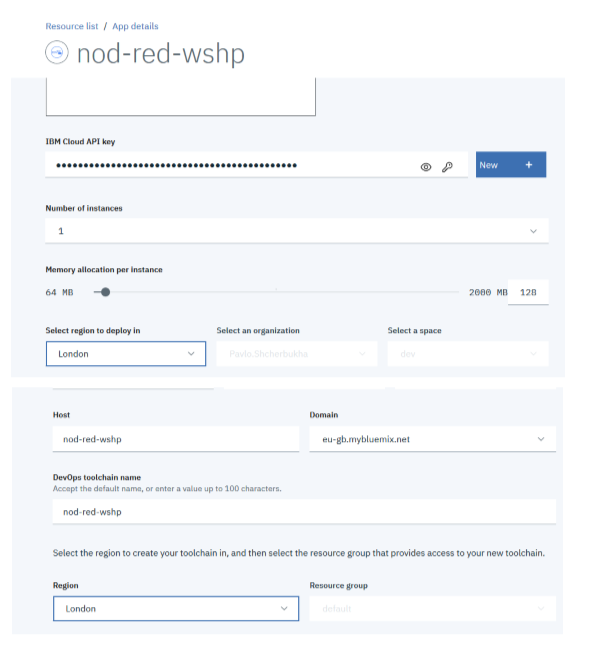
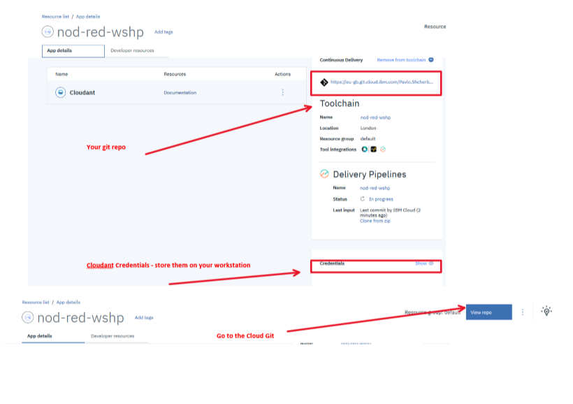
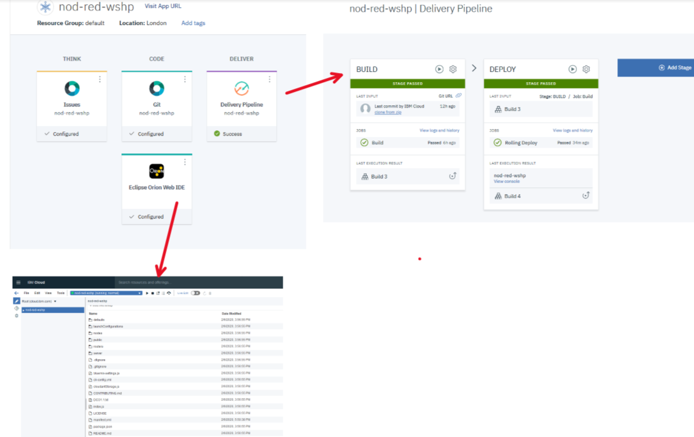

# IBM Node-RED IBM Cloud template 2020. Розгортання додатку в IBM Cloud

## Вибрати в каталозі хмарних сервісів Node-Red

<kbd></kbd>

кліком мишки стартуємо створення додатку. Після цього відкриється вікно, де знадобиться вибрати регіон. Можна вибирати любий, де додаток є, але мені особисто подобається London. Регіон буде запитуватися кілька разів і бажано вибирати одн і той же регіон для всіх компонентів. Тому: 
- на наступному екрані вводимо назву нашоно додатку та вибираємо бажаний регіон (London)

<kbd></kbd>

і натискаємо "Create app".

- З'явиться екран на створення бази даних Cloudant. 

Якщо БД ще не створювалась, то система автоматично запропонує створити БД з тарифним планом Lite. Але, якщо така БД уже була створнеа, потрібно вибрати її у випадаючому списку, або створити нову, але уже платно.

<kbd></kbd>

- Настройка екрану, що створює toolchain

<kbd></kbd>

Тут можна загрузити вихідний код на робочу станцію, та, таки сворити toolchain. На скріншоті показаний діалог створення toolchain. Не забуваємо про один і той же дата центр!

<kbd></kbd>

В кінці кінців отримуємо фінальний екран:

<kbd></kbd>

з усіма нашими компонентами. А якщо перейти у вікно списку ресурсів, побачиом 3 компоненти
<kbd></kbd>

Далі, заходмо в toolchain і розглядаємо її складові
<kbd></kbd>

Тут бачимо елементи інтеграції з git. Середовище, для перегляду та зміни коду пряму в репозиторії. З цього середовища можна і deployment запустити, а можна і debug. Також, справа, бачимо складові "BUILD" та DEPLOY. 

