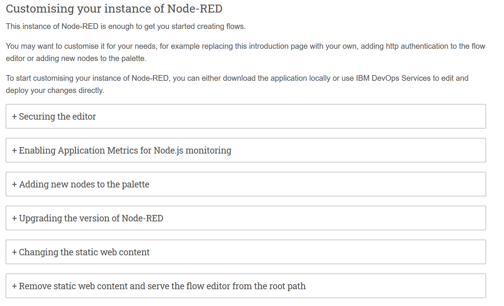

# IBM Node-RED IBM Cloud template 2020. Розгортання додатку в IBM Cloud

<a name="p1"></a>
## Вибрати в каталозі хмарних сервісів Node-Red

<kbd></kbd>

кліком мишки стартуємо створення додатку. Після цього відкриється вікно, де знадобиться вибрати регіон. Можна вибирати любий, де додаток є, але мені особисто подобається London. Регіон буде запитуватися кілька разів і бажано вибирати одн і той же регіон для всіх компонентів. Тому: 
- на наступному екрані вводимо назву нашоно додатку та вибираємо бажаний регіон (London)

<kbd></kbd>

і натискаємо "Create app".

- З'явиться екран на створення бази даних Cloudant. 

Якщо БД ще не створювалась, то система автоматично запропонує створити БД з тарифним планом Lite. Але, якщо така БД уже була створнеа, потрібно вибрати її у випадаючому списку, або створити нову, але уже платно.

<kbd></kbd>

- Настройка екрану, що створює toolchain

<kbd></kbd>

Тут можна загрузити вихідний код на робочу станцію, та, таки сворити toolchain. На скріншоті показаний діалог створення toolchain. Не забуваємо про один і той же дата центр!

<kbd></kbd>

В кінці кінців отримуємо фінальний екран:

<kbd></kbd>

з усіма нашими компонентами. А якщо перейти у вікно списку ресурсів, побачиом 3 компоненти
<kbd></kbd>


Далі, заходмо в toolchain і розглядаємо її складові
<kbd></kbd>

Тут бачимо елементи інтеграції з git. Середовище, для перегляду та зміни коду пряму в репозиторії. З цього середовища можна і deployment запустити, а можна і debug. Також, справа, бачимо складові "BUILD" та DEPLOY. 

## Перевірити, що сервіс запустивя в хмарі

Для цьго зайти в розділ CloudFoundry app вашого спику ресурсів та клікнути на вашому app.

<kbd></kbd>

Відкриється робоча консоль 
<kbd></kbd>
і птрібно зайти на **application UTL** та зробити кілька кроків.

- запаролити вхід
<kbd></kbd>

(для простоти виберемо опцію "без паролю")
<kbd></kbd>

- ознайомитися з посиланнями на ресурси
<kbd></kbd>

- Перейти на стартовий екран, та зайти в Flow Editor
<kbd></kbd>

В результаті побачимо тестовий потік:

<kbd></kbd>

## Корисні ресурси

-   [IBM Node-Red Starter](https://developer.ibm.com/tutorials/how-to-create-a-node-red-
starter-application/)
Тут в основному описано теж саме, що і в цій лабораторній роботі

- [Каталог додаткових вузлів та бібліотек](https://flows.nodered.org/)

- [Різні варіанти кастомізації IBM Node-RED](https://nod-red-wshp.eu-gb.mybluemix.net/#custom)

<kbd></kbd>

### Захистити доступ до редактора потоків
Для цього потрібно установити env variables

```bash
    NODE_RED_USERNAME - the username
    NODE_RED_PASSWORD - the password
    NODE_RED_GUEST_ACCESS - if set to `true`,
    read-only access to the editor
```
### Дадавання нових бібліотек

- Зайти в git репозиотрій нашого toolchain через Orion editor
<kbd></kbd>

або так, як показано на цьому малюнку
<kbd></kbd>

- Знайти файл package.json та відкрити його для редагування (1)
<kbd></kbd>

- додати потрібну бібліотеку (1)
Додати commit message (2)
Зберегти commit в git (3)
<kbd></kbd>

- У вас запуститься процес build (1) та deploy (2)
<kbd></kbd>

Але, як на мене то з локальної станції краще. Тому в наступних лабораторних роботах розглянемо модифікований підхід