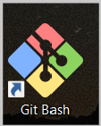
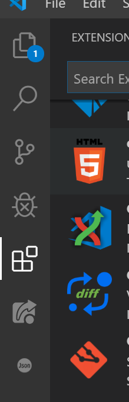

# IBM Node-RED IBM Cloud template 2020. Tools setup - Встановлення програмного забезпечення

# LAB-0-02 - Встановлення програмного забезпечення


<!-- TOC BEGIN -->
- 1 [Вступ](#p1)

- 2 [Встановлення Node.js](#p2)

- 3 [Встановлення Visual Studio Code](#p3)

- 4 [Встановлення системи контролю версій GIT](#p4)

- 5 [Створення Git-Hub облікового запису](#p5)

- 6 [Встановлення Docker](#p6) 

- 7 [Встановлення IBM Cloud CLI](#p7) 

<!-- TOC END -->

<a name="p1"></a>
## Вступ

Документація написана з використанням загадльно-прийнятого формату markdown (файли  типу *.md). Короткий довідник по markdown знаходиться по лінку [markdown help](https://gist.github.com/MinhasKamal/7fdebb7c424d23149140).

Лабораторні роботи розраховані на роботу з OS windows-10


<a name="p2"></a>
## Встановлення Node.js

Скачати та встановити Node.js Latest LTS version [https://nodejs.org/en/download/](https://nodejs.org/en/download)
Перевірка результату встановлення:

```sh
npm -v
node -v
```

Результат повинен бути приблизно таким, або з вищою версією:

```sh
$ npm -v
6.0.9

$ node -v
v10.16.0
```

<a name="p3"></a>
## Встановлення Visual Studio Code

<kbd></kbd>

Microsoft VS Code зараз використовується для багатьох інструментів. В нашому випадку будемо використовувати його для розробки наших app.
Скачати Visual Studio Code for Javascript development по лінку [https://code.visualstudio.com/download](https://code.visualstudio.com/download)

<kbd></kbd>


<a name="p4"></a>
## Встановлення системи контролю версій GIT

- Для Windows:
  Скачати і встановити по линку link [http://git-scm.com/download/win](http://git-scm.com/download/win)

- Перевірка

  Запустити git-bush  та виконати команду  
<kbp></kbp>

```sh
    git --version
```

<kbp></kbp>

<a name="p5"></a>
## Створення Git-hub облікового запису

Для цього потрібно зареєструватися по лінку: Register at [https://github.com](https://github.com)


## Встановлення плагінів до Visual Studio Code

Встановлення та видалення плагінів - важлива частина роботи з VSCode. На малюнку показано, де встановлювати плагіни
<kbd></kbd>

Встановити плагіни, назви яких показані на малюнку
<kbd></kbd>

<a name="p6"></a>
## Встановлення Docker 

 - Створити обліковий запис на [DockerHub](https://hub.docker.com/)

 - Встановити [DockerDesktop for Windows](https://hub.docker.com/?overlay=onboarding)


<a name="p7"></a>
## Встановлення IBM Cloud CLI  
 - Встановлення IBM Cloud CLI  описано по лінку: [IBM Cloud CLI  Installing the stand-alone IBM Cloud CLI](https://cloud.ibm.com/docs/cli?topic=cloud-cli-install-ibmcloud-cli) 
 
