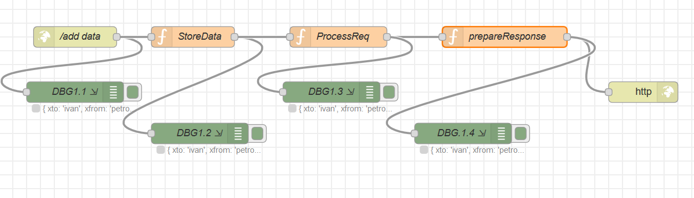

# Програмні складові Node-RED. Node Storing  Conext

Node Strong context використовується для збереження інформації в змінних.
Використовується 3 варіаната контексту


- Global - visible to all nodes
- Flow - visible to all nodes on the same flow (or tab in the editor)
- Node - only visible to the node that set the value

[Node-RED API Context](https://nodered.org/docs/user-guide/writing-functions#context)

## Global context - глобальний контекст

Зберігає глобальні параметри. При чому, глобальні параметри залишаються, навіть коли перебудовується потік.
Основні операції з контекстом

- записати в контекст

```js
        var g_callcounter = g_callcounter +1 ;
        // записати в глобальний контекст з ключем callcount
        global.set('callcount', g_callcounter) ;
```

- прочитати параметр глобального контексту

```js
        // прочитати параметр глобального контексту
        g_callcounter= global.get('callcount');

```
- отримати список всіх параметрів глобального контексту 

```js
        // отримати перелік всіх параметрів глобального контексту в масив, 
        // та повернути у відповіді
        var keys = global.keys();
        var v,k;
        var pl = {}
        for(var i in keys){
            v = global.get(keys[i])
            k = keys[i]
            pl[k] = v
        }
        msg.payload.keys = pl ;
```

Для тестування роботи контексту розроблений тестовий потік

<kbd></kbd>

Потік у файлі Flows/flow-2-globalcontext.json

node: **StoreData**
Створює глобальний контекст, що відраховує зверення до методі

```js
    /**
    * Демонстрація використання глобального контексту
    * Для демонстрації створена плобальна змінна callcount, що підраховує звернення до сервісу
    * 
    * При формуванні відповіді сервіса, кількість звернень повертається у реквізиті: calls
    * 
    */
    var g_callcounter;
    // прочитати  параметр глоального контексту
    g_callcounter= global.get('callcount');
    if (typeof g_callcounter === 'undefined') {
        global.set('callcount', 0) ;
        g_callcounter = global.get('callcount');
    }
    g_callcounter = g_callcounter +1 ;
    // записати в глобальний контекст
    global.set('callcount', g_callcounter) ;
    return msg;
```

Node: **prepareResponse**
Формує відповідь

```js
    /**
    *  Формування відповіді 
    *
    */
    // прочитати параметр глобального контексту
    g_callcounter= global.get('callcount');
    //Передати контекст у відповіді
    msg.payload.calls =  g_callcounter ; 
    // отримати перелік всіх параметрів глобального контексту в масив, 
    // та повернути у відповіді
    var keys = global.keys();
    var v,k;
    var pl = {}
    for(var i in keys){
        v = global.get(keys[i])
        k = keys[i]
        pl[k] = v
    }
    msg.payload.keys = pl ;
    return msg;
```

## Тестування сервісу

- Сервіс приймає на вхід post запит

url=https://nod-red-wshp.eu-gb.mybluemix.net/add

Headers:

```text
    Content-Type: application/json
```

**Request:**

```text
    {
        "xto": "ivan",
        "xfrom": "petro",
        "xsubj": "read the book",
        "xmsg": "Hi I am here!"
        
    }
```

**Response:**

```text
    {
    "xto": "ivan",
    "xfrom": "petro",
    "xsubj": "read the book",
    "xmsg": "Hi I am here!",
    "calls": 18,
    "keys": {
        "rsstojson": {},
        "callcount": 18
        }
    }

```

З кожним викликом змінюється параметр:     "calls": 18

Параметр "keys" показує весь перелік параметрів глобального контексту

    "keys": {
        "rsstojson": {}, // клас, що працює з rss стрічками
        "callcount": 18 // кількість викликів
    }

## flow context - контекст потоку

Існують аналогічні функції, як і для глобального контексту
- flow.get(..) : get a flow-scoped context property
- flow.set(..) : set a flow-scoped context property
- flow.keys(..) : return a list of all flow-scoped context property keys
Для тестування  створемо на вході один параметр, а при підготовці відповіді - прочитаємо його.

У запиті додамо:

```js
  // запис параметру в flow conext
  flow.set( 'flw-orig-req', msg.payload) ;
```

при підготовці відповіді

```js
   msg.payload.flowprm = flow.get( 'flw-orig-req' );
```


В прикладі Response видно, що оригінальний запит зберігся у параметрі **flowprm**

```json
    {
        "xto": "ivan",
        "xfrom": "petro",
        "xsubj": "read the book",
        "xmsg": "Hi I am here!",
        "calls": 20,
        "keys": {
            "rsstojson": {},
            "callcount": 20
        },
        "flowprm": {
            "xto": "ivan",
            "xfrom": "petro",
            "xsubj": "read the book",
            "xmsg": "Hi I am here!"
        }
    }
```
