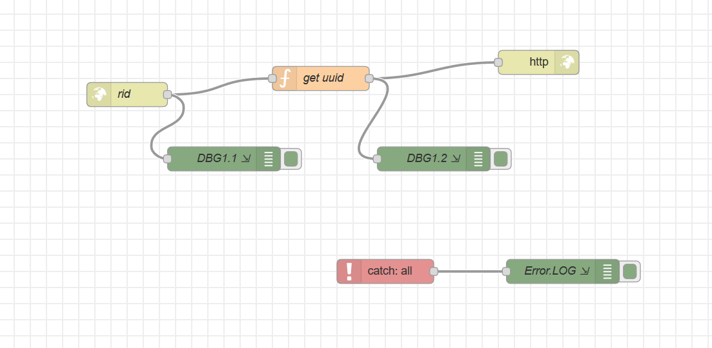

# Програмні складові Node-RED. Підключення зовнішніх бібліотек аналог reqire('node-module')

Для підключення зовнішніх модулей, необхідний модуль потрібно додати в json-стурктурі в файлі **bluemix-settings.js**, структура: **functionGlobalContext**
На приклад:

```js
    functionGlobalContext: { 
        uuidv4: require('uuid/v4'),
        rsstojson: require('rss-to-json')

    }
```

В цьому прикладі підключаються 2 модулі:
- uuid/v4 - для генерації id
- rss-to-json - біблиотека по обробці rss стрічок

Далі, наведений фрагмент коду, який показує, як використовувати підключені бібліотеки 

```js
    //const uuidv4 = require('uuid/v4');
    var uuidv4 = global.get('uuidv4');
    var xrss = global.get('rsstojson');

    let IdRec = uuidv4();

    msg.payload={uuid: IdRec, xuuid: 'uuidv4', xxrss: xrss};

    xrss.load('https://learnstartup.net/feed/', function(err, rss){
        console.log(rss);
        msg.payload.rss=rss
        node.send(msg);
    });

    return ;
```
Також, потрібно звернути увагу на правильність оформлення коду при використанні callback

```js
    xrss.load('https://learnstartup.net/feed/', function(err, rss){
        console.log(rss);
        msg.payload.rss=rss
     //  ----------------
        node.send(msg);
    });
    // ---------------
    return ;
```

тестовий потік показаний на малюнку
<kbd></kbd>

Сам потік знаходиться в файлі: flows/
URL=https://nod-red-wshp.eu-gb.mybluemix.net/rid
Метод:  get

метод повертає згенерований uuid та xml rss стрічки новин

```json
{"uuid":"57984cd1-b0fa-466d-82aa-32b2a7cc2a11",
 "xuuid":"uuidv4",
"xxrss":{},
"rss":{"items":[{ "title":"React Hooks",
                  "description":"Learn the future of creating Reactapps....."
                 }
                ]
      } 
}               
```