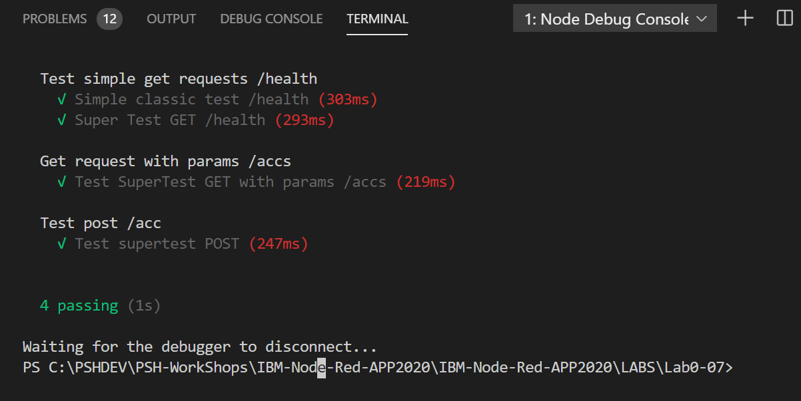

# Програмні складові Node-RED. 
# Використання принципів автоматичного тестування


Node-Red являє собою звичайне Node.JS application.  Тому, для його тестування спроуємо принципи test-driven development

## Використовуємо такі бібліотеки

```text
    "chai": "^4.2.0",
    "chai-http": "^4.3.0",
    "jest": "^25.1.0",
    "mocha": "^7.0.1",
    "nock": "^11.8.2",
    "sinon": "^8.1.1",
    "sinon-chai": "^3.4.0",
    "supertest": "^4.0.2"
```

Для підготовки тестових кейсів використовуємо 3 потоки, що дозволяють отримати поняття по автоматизоване тестування:

- простий http get

- http get з параметрами

- http post

Набір потоків знаходиться у файлі: [Flows/flow-test-cases.json](Flows/flow-test-cases.json).
Для тестування потрібно створити тестове app

## Створення тестового application

```text
   ## створення основних копопнентів
   npm install init
   
   ## накачка пакетів
   npm install chai
   npm install chai-http 
   npm install jest
   npm install mocha 
   npm install nock
   npm install sinon
   npm install sinon-chai
   npm install supertest
```

Створити каталог test  і в нього покласти тестовий файл:
[test/test-get-health.js](test/test-get-health.js)

В каталозі **.vscode** знаходиться **launch.json**, що дозволяє запустити тестовий кейс в режимі відладки. 

Використовуємо такі інструменти

```js
    const mocha = require('mocha');
    const chai = require('chai');
    const request = require('supertest');
```
За допомогою chai та supertest можна легко побудувати серію  тестових http запитів
Приклад логу роботи тестових кейсів показана на молюнку
<kbd></kbd>

Потрібно розуміти, що точність тестових кейсів задежить від початкового запиту.
В процесі розробки тестові кейси можуть деалізуватися та розширбватися. Це і називається  test-driven development.

