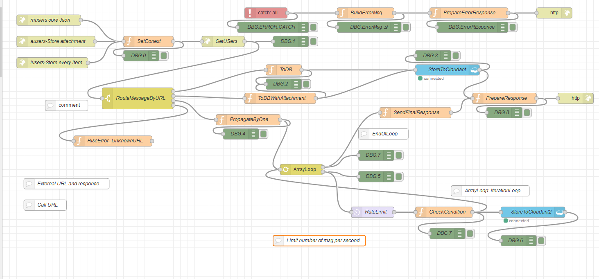

# Програмні складові Node-RED. 
# Приклад потоку, що виконує запит до зовнішнього сервісу та результати відповіді записує в базу данних Cloudant


## Короткий опис потоку
Потік має 3  URL з http GET:

- /musers  

Отримати дані з зовнішнього сервісу  у вигляді JSON та записати  відповідь у БД як один JSON.

- /ausers

Отримати дані з зовнішнього сервісу  у вигляді JSON та записати  відповідь у БД як attachment. Тобто у базі даних буде присутній описовий json та вклаження у вигляді бінарного файлу.

- /iusers


Отримати дані з зовнішнього сервісу  у вигляді JSON, розібрати масив отриманих елеменів та по одному  записати  відповіді у БД, а потім уже дати відповідь по http.

## Зовнішній сервіс

В якості зовнішнього сервісу використовуємо URL
**http://dummy.restapiexample.com/**, що повертає набір данних співробітників такої структри:
```json
{
  "status": "success",
  "data": [
    {
      "id": "1",
      "employee_name": "Tiger Nixon",
      "employee_salary": "320800",
      "employee_age": "61",
      "profile_image": ""
    },
    {
      "id": "2",
      "employee_name": "Garrett Winters",
      "employee_salary": "170750",
      "employee_age": "63",
      "profile_image": ""
    },
    {
      "id": "24",
      "employee_name": "Doris Wilder",
      "employee_salary": "85600",
      "employee_age": "23",
      "profile_image": ""
    }
  ]
}

```

## Приклад потоку обробки

Скрін потоку показаний на малюнку:
<kbd></kbd>

Сам код потоку можна отримати в файлі:  [Flows/make-http_req.json ](Flows/make-http_req.json).

## Пакети, що використовуються
Пакети, що використовуються вказані в package.json


```json
{
  "name": "node-red-app",
  "version": "1.1.1",
  "dependencies": {
    "@cloudant/cloudant": "^4.2.2",
    "bcrypt": "^3.0.7",
    "body-parser": "1.x",
    "cfenv": "^1.2.2",
    "express": "4.x",
    "http-shutdown": "1.2.2",
    "node-red": "1.x",
    "node-red-node-cf-cloudant": "0.x",
    "node-red-node-openwhisk": "0.x",
    "node-red-node-watson": "0.x",
    "node-red-nodes-cf-sqldb-dashdb": "0.x",
    "ibm-cloud-env": "^0"
  },
  "scripts": {
    "start": "node --max-old-space-size=160 index.js --settings ./bluemix-settings.js -v"
  },
  "engines": {
    "node": "12.x"
  }
}

```